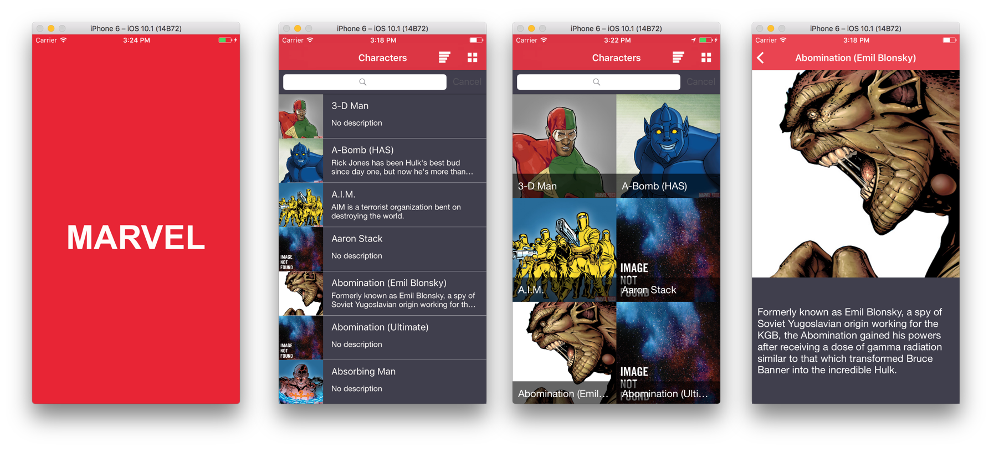

# Marvel - Mobile Exercise #

This is a iOS app created using Swift and the [Marvel Developer API](https://developer.marvel.com/).
You can search and save the chracteres you like most.

## Requirements

* Xcode 11.2
* iOS 12.4 +
* Swift 5.1

For security reasons I did not leave the public and private keys of the Marvel api in the project, so it is necessary to create an account on the site [Site Developer Marvel](https://developer.marvel.com)

## Architecture

This app is using `MVVM`, with  `Coordinators` on navigate between screens.
Also this app is using Repository to abstract the datasource from the viewModel. The Repository transform the service model (or database model) to app model for the purpose of isolate this layers.

### Coordinators
An iOS navigation coordinator written in Swift 5.1.

<details>
  <summary>Click to expand!</summary>

### About
There are a lot of implementations floating around the iOS community of using Coordinators to remove the burden of navigation from `UIViewController`s. The Coordinator pattern is so broad, however, that there a lot of different interpretions of how to implement it.

This is my own take on the Coordinator pattern.

### Purpose
In my opinion, a Coordinator serves three main purposes:

1. Handle the preparation, navigation between, and presentation of at least one - but often many - view controllers.
2. Liase between different services, like a Networking Service, in order to pull business logic out of our view controllers.
3. Optionally manage child Coordinators, in order to divy up responsibilities of complex navigation routes.

### How To Use

#### Coordinator
The coordinator sits above your view controllers and directs the flow of traffic via delegates. 

For instance, say you had a view controller for browsing products to buy and wanted to tap into a product's detail, it would usually look something like this:

```swift
final class BrowseProductsViewController: UIViewController {
    
    func onProductTapped(product: Product) {
        let productDetailViewController = ProductDetailViewController(product: product)          
        navigationController?.pushViewController(productDetailViewController, animated: true)    
    }
    
}

```

With a `Coordinator`, it would be broken up something like this:

```swift
// The delegate we'll use to talk to the Coordinator

protocol BrowseProductsViewModelDelegate: class {
    func browseProducts(didTapProduct product: Product)
}

// Our viewModel, now using the delegate

final class BrowseProductsViewModel {
    
    // Note the strong reference
    var delegate: BrowseProductsViewModelDelegate?
    
    func onProductTapped(product: Product) {
        delegate?.browseProducts(didTapProduct: product)
    }
    
}

// Our revised view controller, now using the viewModel

final class BrowseProductsViewController: UIViewController {
    
    // Also Note the strong reference
    var viewModel: BrowseProductsViewModel
    
    func onProductTapped(product: Product) {
        delegate?.browseProducts(didTapProduct: product)
    }
    
}

// The view controller's owning coordinator

final class BrowseProductsCoordinator: CoordinatorNavigable { 
    
    // Our custom UINavigationController wrapper
    weak var navigator: NavigatorType?
    
    init(navigator: NavigatorType) {
        self.navigator = navigator
    }
    
    func start() {
        
        // here we make the scene's configuration injecting the dependencies
        let rootViewModel = BrowseProductsViewModel()
        rootViewModel.delegate = self 
        let rootViewController = BrowseProductsViewController(rootViewModel)
        navigator.push(rootViewController)
    }

}

// With delegate conformance 

extension BrowseProductsCoordinator: BrowseProductsViewModelDelegate {

    func browseProducts(didTapProduct product: Product) {
        let productDetailViewController = ProductDetailViewController(product: product)  
        
        // In a more complex situation, here's where the Coordinator could reference services,
        // like fetching information from the network or the local data store,
        // to prepare the view controller for presentation.
        
        navigator.push(productDetailViewController, animated: true)
    }

}

```

In the refactored code using a `Coordinator`, we've taken away the view controller's knowledge of where it's been and where it's going. This ostensibly makes our view controller just a view, making it incredibly reusable, and pulls out routing and business logic to be handled by something else.
In addition, the pain of knowing when a controller is removed from the stack has been resolved because, when the controller is removed from the stack, the coordinator is also automatically removed (unless the coordinator has multiple controllers, but it makes sense).

#### Navigator
The `Navigator` is a wrapper / proxy for a `UINavigationController`, providing methods for the coordinator to push and pop view controllers on the navigation stack. 

The reason for using `Navigator` rather than a regular `UINavigationController` is that it allow us centralize the app transitions and if we need custom this transitions its more easier do it.

#### Coordinators can be used how you want


A single Coordinator could be used to route to multiple view controllers in a flattened hierarchy:


But it could also have one, or many, child coordinators which is responsible for a specific chunk of navigation:


It's a very flexible pattern, so use it how you determine best!

### Example Project
In this repo you'll see an example project of how someone might use the Coordinator pattern in an actual app.

In many examples I've found online, the pattern itself is often combined with ViewModels and/or using Reactive binding ("MVVM-C"). While these approaches can be helpful in solving certain problems, the Coordinator pattern itself can be used - and maybe better understood - without these added abstractions.

With that, my example project focuses exclusively on the relationship between Coordinators, ViewModels and ViewControllers, in an intentional effort to avoid the confusion of mixing together multiple patterns.

### Credits
Thanks for checking out my take on coordinators -- I hope it's helpful if you're exploring the pattern to use in a project. if you have any suggestions or improvements, feel free to submit a PR! 

I borrowed from a lot of examples around the community and want to thank / credit the following for inspiration and ideas:

[Soroush Khanlou: Presenting Coordinators](https://vimeo.com/144116310)  
[Ian MacCallum: Coordinators, Routers, and Back Buttons](https://hackernoon.com/coordinators-routers-and-back-buttons-c58b021b32a)  
[Paul Hudson: How to use the coordinator pattern in iOS apps
](https://www.hackingwithswift.com/articles/71/how-to-use-the-coordinator-pattern-in-ios-apps)
[Dave Neff - Coordinator](https://github.com/daveneff/Coordinator)

</details>

## Features

* ✅ **No Storyboard:** Views develop using view code, with no broken contraints.
* ✅ **Unit Tests:** 59 (code coverage: ~79%)
* ✅ **UITests:** 0
* ✅ **Devices:** iPhone 5s, iPhone11.
* ✅ **iOS:** 12.4+.

🌟 💯 All tests passed using above configurations. 🌟

This project takes advantage of `Protocols` and `Generics` to reuse views and cells.

On Swift 5.1 I can use `Result` type to handle network responses better. 

You can favorite a character right from the catalog screen, just do a long press over any item and the options to that character will show up.

## Pods
CocoaPods is a dependency manager for Swift and Objective-C Cocoa projects

<details>
  <summary>Click to expand!</summary>
  
#### pod 'VService'
is an HTTP networking library written in Swift.

#### pod 'VCore'
is an library with extensions and generics functions to helper development, written in Swift.

#### pod 'SnapKit'
Less verbose Auto-Layout constraints [link](https://github.com/SnapKit/SnapKit). 

#### pod 'Hero'
is a library for building iOS view controller transitions [link](https://github.com/HeroTransitions/Hero). 

#### pod 'CollectionKit'
A modern Swift framework for building composable data-driven collection view [link](https://github.com/SoySauceLab/CollectionKit). 

#### pod 'RxSwift, RxCocoa'
An API for asynchronous programming
with observable streams [link](https://github.com/ReactiveX/RxSwift). 

#### pod 'CryptoSwift'
CryptoSwift is a growing collection of standard and secure cryptographic algorithms implemented in Swift [link](https://github.com/krzyzanowskim/CryptoSwift).

#### pod 'cocoapods-keys'
A key value store for enviroment and application keys [link](https://github.com/orta/cocoapods-keys).

</details>
  
## How to install

* Clone or download the project to your machine.
* At the project directory run: ```bundle install``` and then ```bundle exec pod install```.
* Open XCode11+ and build the project using: ```Cmd```+ ```Shift``` + ```B```.
* Build the project for testing using: ```Cmd```+ ```Shift```+ ```U```.
* Run the tests using: ```Cmd``` + ```U```


### Artboard


### Reference

Screens: [thiagolioy/marvelapp-SketchProject](https://github.com/thiagolioy/marvelapp-SketchProject)  
cocoa-keys: [thiagolioy/tools-pods-tricks](https://medium.com/cocoaacademymag/creating-a-ios-app-from-scratch-tools-pods-tricks-of-the-trade-and-more-part-1-a0a3f18fbd13#.fu8u4puxu)

### Next Steps  
- [X] Add screens  
- [X] Add travis CI  
- [X] Implementing unit tests with RxTest and RxBlocking.
- [ ] Create code documentation with Jazzy.  
